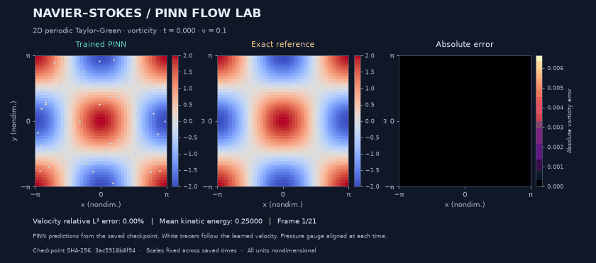
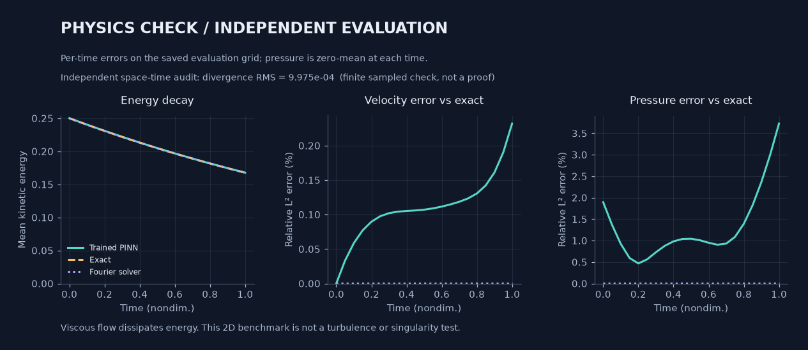

# Navier–Stokes PINN Lab

**Train a neural fluid field. Watch it move. Check where it is wrong.**

A small, CPU-runnable 2D Navier–Stokes lab: a real physics-informed neural network, an exact Taylor–Green reference, and an independent Fourier/RK4 solver. Includes trained weights, measured errors, particle motion, and an offline interactive replay.



The left panel comes from the **trained network**, not an analytic animation. White tracers are integrated through its predicted velocity. Color scales stay fixed throughout the replay.

## Run it

Python 3.10+; no API key, dataset download, GPU, or cloud account. The included checkpoint lets you run inference without training first.

```bash
git clone --branch oguzhankir/verified-pinn-demo https://github.com/oguzhankir/navier-stokes-pinn-lab.git
cd navier-stokes-pinn-lab
python -m venv .venv
source .venv/bin/activate
python -m pip install torch --index-url https://download.pytorch.org/whl/cpu
python -m pip install -e .
pinnlab demo
```

On Windows, activate with `.venv\Scripts\Activate.ps1` in PowerShell. If you already have a suitable PyTorch installation, skip the separate `torch` install.

`demo` loads the checkpoint, **recomputes predictions and audits**, runs the Fourier solver, then opens `runs/demo/comparison.html`. The HTML works offline and has time/playback controls. It replays exported frames; it does not execute PyTorch in the browser.

```bash
# Headless: generate HTML, GIF, PNGs, raw arrays, and metrics without opening a window
pinnlab demo --no-open --output runs/headless

# Desktop GUI: switch vorticity / speed / pressure, exact / Fourier reference,
# and a deliberately wrong zero-field control. Requires a GUI Matplotlib backend.
pinnlab demo --interactive --output runs/interactive
```

Use a new output directory for each experiment, or explicitly add `--overwrite` to reuse one. Run from this checkout: the showcase weights are repository assets, not bundled wheel data.

## What was actually measured?

The committed [metrics](examples/taylor-green/metrics.json), [training configuration](examples/taylor-green/training.json), and [loss history](examples/taylor-green/history.csv) describe one real run: seed 42, float64, one CPU thread, ν = 0.1, t ∈ [0, 1]. Evaluation uses a 48 × 48 spatial grid at 21 times and 2,048 independent random space–time audit points.

| Check | Trained PINN | Fourier/RK4 reference |
| :--- | ---: | ---: |
| Velocity relative L² error at t = 1 | 0.2320% | 3.48 × 10⁻¹¹% |
| Pressure relative L² error at t = 1 | 3.7257% | 6.96 × 10⁻¹¹% |
| Vorticity relative L² error at t = 1 | 0.2499% | — |
| Mean kinetic energy at t = 1 | 0.167699 | 0.167580 |
| Training wall time | 78.95 s | Not applicable |

Exact mean kinetic energy is 0.167580. The PINN's held-out momentum RMS is 1.98 × 10⁻³ and divergence RMS is 9.98 × 10⁻⁴; these are nondimensional residuals, not relative errors. Initial velocity is enforced by construction, so its near-zero error is not evidence of learned accuracy.



The PINN is **not more accurate than the classical solver here**. This smooth, single-mode benchmark is especially favorable to a Fourier method. Measured field-and-curl inference took 0.241 s; numerical integration/reconstruction took 0.069 s. These are single timings with different scopes, not a speed benchmark. PINN inference timing excludes loading, training, audits, tracers, file I/O, and rendering. Full scope and environment are recorded in `metrics.json`.

## Train and reproduce

```bash
# Exact showcase configuration (1,500 Adam updates, L-BFGS max_iter=500)
pinnlab train --output runs/my-run --nu 0.1 --tmax 1 --mode 1 \
  --width 32 --depth 3 --adam-steps 1500 --lbfgs-steps 500 \
  --batch-size 512 --seed 42 --threads 1 --dtype float64 --device cpu
pinnlab evaluate --run runs/my-run --grid 48 --frames 21 \
  --residual-points 2048 --dt 0.02 --threads 1
pinnlab render --run runs/my-run
```

Recorded environment: Python 3.12.14, PyTorch 2.8.0+cpu, NumPy 2.5.3, Linux x86_64; figures used Matplotlib 3.11.1 and Pillow 12.3.0. Seeds reproduce the setup, not necessarily bit-identical results across software versions or hardware. CPU provenance records the architecture, not a specific processor model. The showcase used 529 L-BFGS **closure evaluations**, which are not the same as optimizer iterations.

`train` writes weights and training provenance. `evaluate` loads those weights and writes `fields.npz` plus `metrics.json`. `render` consumes only those evaluated arrays. SHA-256 checks reject stale or modified arrays/checkpoints; reevaluate after retraining. The repository ships only the small checkpoint, provenance, history, and preview figures—not the regenerable raw arrays or embedded-frame HTML.

## How the PINN works

We solve the unforced, incompressible, density-normalized equations on the periodic domain [−π, π)²:

$$
\partial_t\mathbf{u}+(\mathbf{u}\cdot\nabla)\mathbf{u}
=-\nabla p+\nu\Delta\mathbf{u},\qquad \nabla\cdot\mathbf{u}=0.
$$

A tanh MLP maps `(sin x, cos x, sin y, cos y, 2t/T − 1)` to three outputs. Periodic features enforce matching values and derivatives at the spatial seams. The default velocity parameterization is `u₀ + (t/T) Nᵤ`, `v₀ + (t/T) Nᵥ`, so it satisfies the prescribed initial velocity exactly. Pressure is anchored at `p(0,0,t) = 0`. Autodiff supplies the first and second derivatives needed by the PDE residual.

Adam resamples collocation points; L-BFGS refines on one fixed set. The loss is mean squared momentum residual + mean squared divergence + 10 × initial-velocity MSE. The IC term is zero in the hard-constraint model. `--soft-ic` removes that hard constraint for an optional experiment; no soft-IC performance is claimed here.

**Training sees the PDE and prescribed t = 0 velocity only.** No future exact velocity, pressure, or numerical-solver labels enter optimization. The known initial condition is an intentional inductive bias, not a learned result.

For mode k, the independent exact check uses F = exp(−2νk²t):

$$
u=-\cos(kx)\sin(ky)F,\quad
v=\sin(kx)\cos(ky)F,\quad
p=-\tfrac14[\cos(2kx)+\cos(2ky)]F^2.
$$

Pressure comparisons remove each field's spatial mean separately at every time. Energy means `0.5 × spatial_mean(u² + v²)`, whose exact value is `0.25 exp(−4νk²t)`; it is not the domain integral. All coordinates and fields are nondimensional.

The numerical reference genuinely time-steps the vorticity equation using Fourier differentiation, 2/3 dealiasing, and RK4, with a padded pressure reconstruction. Only its initial state uses the exact formula. Tests include a nonsymmetric multimode flow with nonzero nonlinear transport, since Taylor–Green alone would not test that term adequately.

### Zero residual does not identify the right flow

The desktop viewer includes a **constructed diagnostic control, not a failed trained model**: zero velocity with constant pressure. It has zero unforced PDE residual and divergence, yet 100% relative initial-velocity error for this nonzero initial condition. A low residual alone is not enough; check initial/boundary conditions and independent solution error too.

## Simulation is not a proof

Context, checked September 9, 2026: OpenAI's [September 8 announcement](https://openai.com/index/navier-stokes-solution/) describes an analytical and Lean-formalized result concerning finite-time breakdown of **3D forced** Navier–Stokes flow. The [paper](https://cdn.openai.com/pdf/32d9f210-8b73-45e0-91bc-82a30aef8a9a/navier-stokes.pdf) and [formalization repository](https://github.com/openai/NavierStokesAndEuler) are the primary materials. The announcement describes a tool-using multi-agent proof search, not this PINN training procedure.

This lab neither reproduces nor independently verifies that proof. It approximates a particular **2D unforced**, finite-time initial-value problem. A sampled residual, animation, or accurate benchmark is not an existence, regularity, or singularity proof. See the [official Clay problem statement](https://www.claymath.org/wp-content/uploads/2022/06/navierstokes.pdf) for the mathematical question.

This is a laminar educational benchmark, not 3D turbulence or a production CFD package. Reducing viscosity here slows the exact vortex decay; it does not turn this solution into turbulence. A trained model is specific to its initial condition, viscosity, mode, and time interval. Do not interpret changes to those values or time extrapolation as validated predictions.

## Existing work and this repo's niche

PINNs and neural Navier–Stokes solvers are established research, not a new discovery in this repository.

| Primary source | Why it matters here |
| :--- | :--- |
| [Original PINNs](https://maziarraissi.github.io/PINNs/) · [NSFnets](https://arxiv.org/abs/2003.06496) | Foundational physics-informed and incompressible-flow methods. |
| [Exact periodic neural representations](https://arxiv.org/abs/2007.07442) | Prior work on building periodicity into the model. |
| [DeepXDE](https://github.com/lululxvi/deepxde) · [JAX-PI](https://github.com/PredictiveIntelligenceLab/jaxpi) | Broader tools and stronger research baselines; this repo does not replace them. |
| [Existing Taylor–Green PINN example](https://github.com/mattialoszach/navier-stokes-pinn) | Acknowledges that a Taylor–Green PINN by itself is not novel. |
| [PINNacle](https://github.com/i207m/pinnacle) · [An expert's guide to training PINNs](https://arxiv.org/abs/2308.08468) | Wider evaluation and training practice beyond this small example. |
| [Characterizing possible failure modes in PINNs](https://arxiv.org/abs/2109.01050) | Motivation for checking solution quality beyond training loss. |

The contribution is an inspectable learning tool: **real checkpoint → fresh inference → exact/classical comparison → visible errors**, with a small codebase and reproducible provenance. No new architecture or state-of-the-art claim.

## Development

```bash
python -m pip install -e '.[dev]'
pytest -q
ruff check .
ruff format --check .
```

`src/pinnlab/` contains physics, the network, training, evaluation, the numerical reference, and visualization. `tests/` checks derivatives, exact PDE residuals, periodicity, initial conditions, pressure gauge, numerical convergence, checkpoint replay, artifact integrity, and CLI behavior. `examples/taylor-green/` is the measured showcase. Contributor constraints live in [AGENTS.md](AGENTS.md).

MIT licensed. Contributions should include a DCO sign-off (`git commit -s`).
